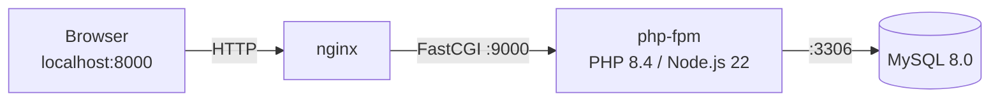

# app

Laravelアプリケーションのローカル開発環境（Docker）です。

## アーキテクチャ



## 起動方法

プロジェクトルートで以下を実行します（`Makefile`参照）。

```bash
make app-up    # バックグラウンド起動（マイグレーション・初期データ投入まで自動実行）
make dev-up    # フォアグラウンドでログを表示しながら起動（Ctrl+Cで停止）
make build-assets  # CSS/JS（Tailwind/Vite）を再ビルド
make infra-down    # コンテナとDBデータ（ボリューム）を含めて削除
```

コマンド一覧は `make` （引数なし）で確認できます。起動後は `http://localhost:8000` でアクセスできます。
