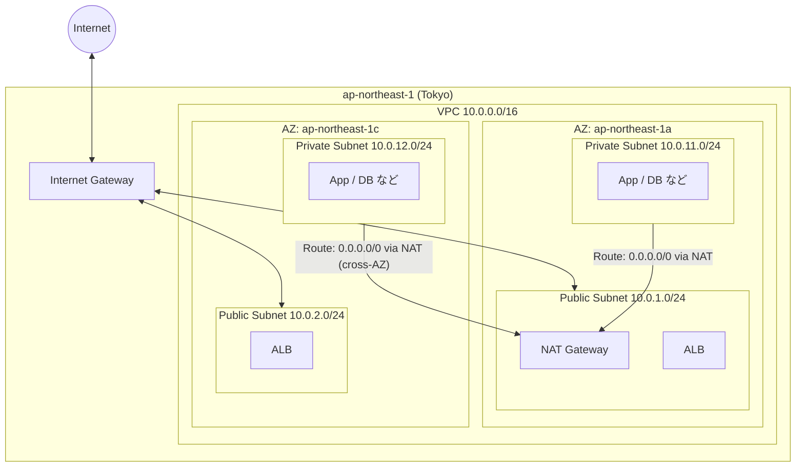
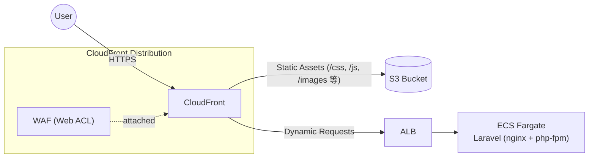

# infra

AWS上に本番環境を構築するためのTerraformコードを配置するディレクトリです。

## 想定構成

- CloudFront → ALB → ECS(Fargate)
- ECSタスク内: nginx + php-fpm（`app/`と同じコンテナ構成）
- RDS for MySQL

## VPC構成案（東京リージョン）

- リージョン: ap-northeast-1（東京）
- VPC CIDR: `10.0.0.0/16`
- 2つのAZにPublic/Privateサブネットをそれぞれ配置（第3オクテットで区切り）
  - Public: `10.0.1.0/24`（AZ-a）, `10.0.2.0/24`（AZ-c）
  - Private: `10.0.11.0/24`（AZ-a）, `10.0.12.0/24`（AZ-c）
- Internet Gatewayを1つ設置し、Publicサブネットからインターネットへ疎通
- NAT GatewayはAZ-aのPublicサブネット（`10.0.1.0/24`）にのみ1台設置（コスト優先、AZ-a障害時はアウトバウンド通信のみ影響を受ける）
- Publicサブネットは2AZとも維持（ALBがマルチAZ必須のため。ALBの可用性とNATの可用性は別軸）
- Privateサブネットのルートテーブルは、両AZともAZ-aのNAT Gateway経由でインターネットへ出る経路を設定
  - `10.0.11.0/24` → `10.0.1.0/24`のNAT Gateway
  - `10.0.12.0/24` → `10.0.1.0/24`のNAT Gateway（AZをまたいで参照）

## 配信アーキテクチャ案

- CloudFrontをエントリポイントとし、WAF（Web ACL）をアタッチしてリクエストをフィルタリング
- 静的アセット（画像・CSS/JS等）はS3から配信
- 動的リクエストはALB経由でECS(Fargate)上のLaravelアプリ（nginx + php-fpm）へ

## 現状

Terraformコードは未着手です。今後このディレクトリ配下に追加していきます。
