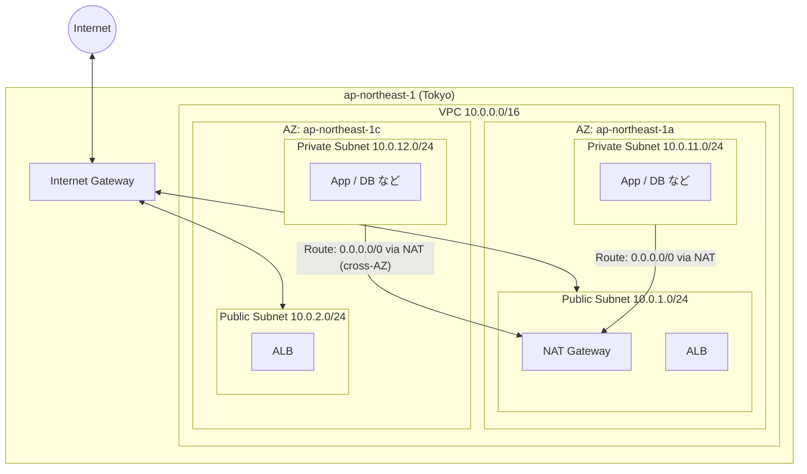
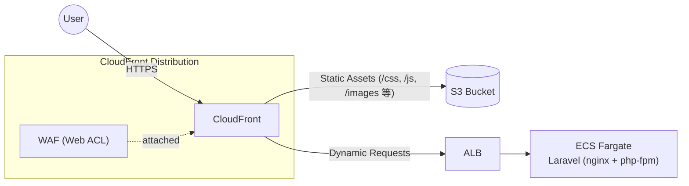
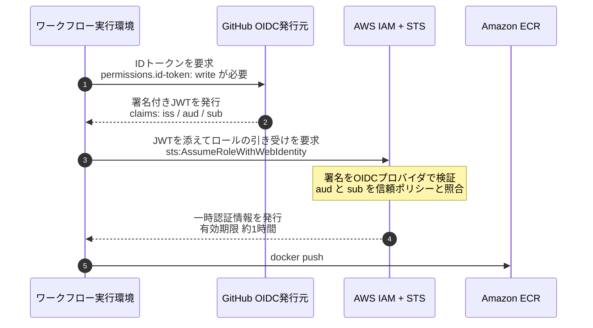
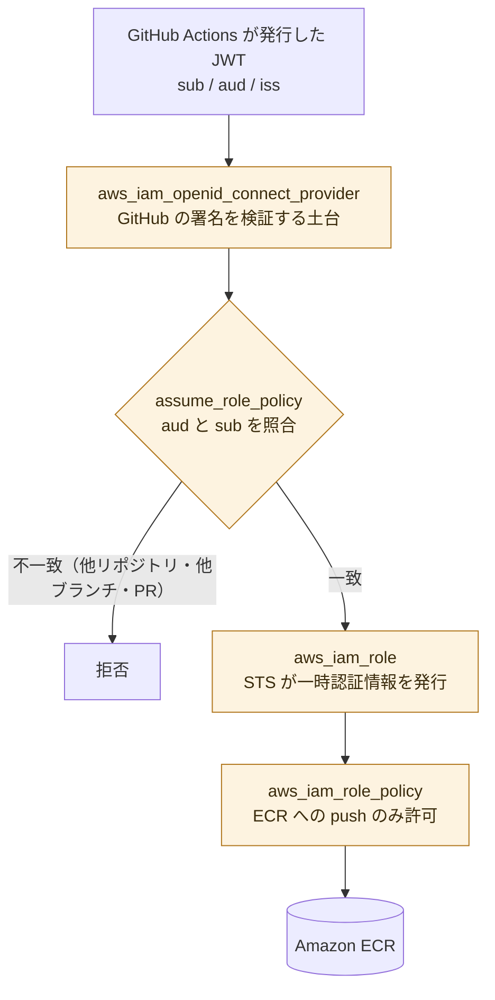
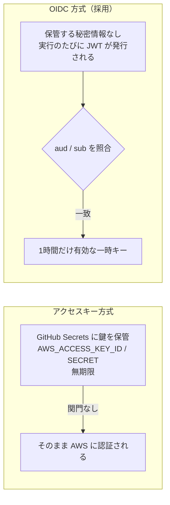
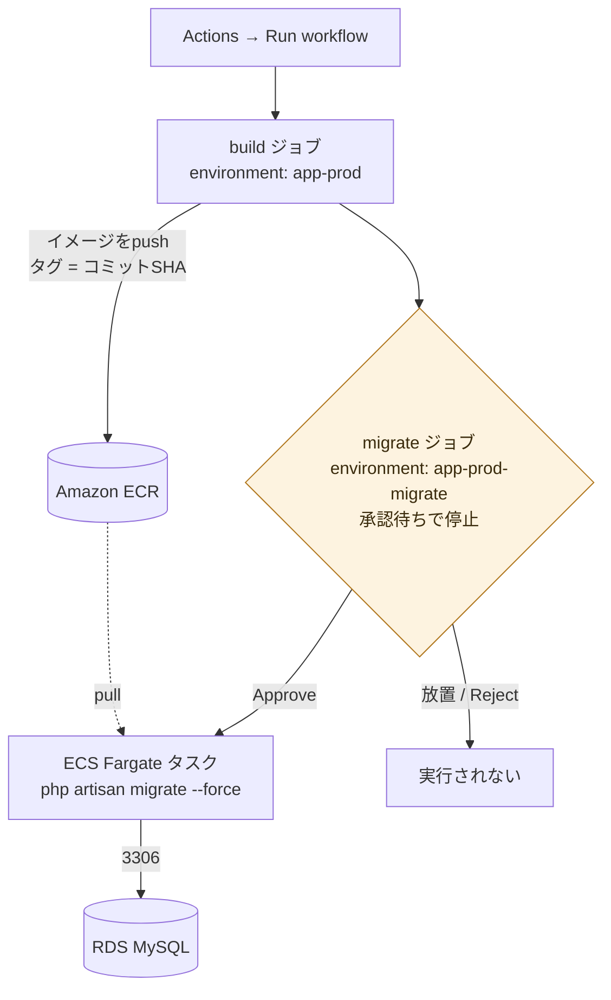
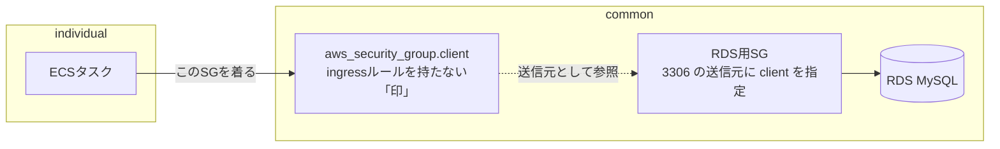

# infra

AWS上に本番環境を構築するためのTerraformコードを配置するディレクトリです。

## 想定構成

- CloudFront → ALB → ECS(Fargate)
- ECSタスク内: nginx + php-fpm（`app/`と同じコンテナ構成）
- RDS for MySQL

## VPC構成案（東京リージョン）

- リージョン: ap-northeast-1（東京）
- VPC CIDR: `10.0.0.0/16`
- 2つのAZにPublic/Privateサブネットをそれぞれ配置（第3オクテットで区切り）
  - Public: `10.0.1.0/24`（AZ-a）, `10.0.2.0/24`（AZ-c）
  - Private: `10.0.11.0/24`（AZ-a）, `10.0.12.0/24`（AZ-c）
- Internet Gatewayを1つ設置し、Publicサブネットからインターネットへ疎通
- NAT GatewayはAZ-aのPublicサブネット（`10.0.1.0/24`）にのみ1台設置（コスト優先、AZ-a障害時はアウトバウンド通信のみ影響を受ける）
- Publicサブネットは2AZとも維持（ALBがマルチAZ必須のため。ALBの可用性とNATの可用性は別軸）
- Privateサブネットのルートテーブルは、両AZともAZ-aのNAT Gateway経由でインターネットへ出る経路を設定
  - `10.0.11.0/24` → `10.0.1.0/24`のNAT Gateway
  - `10.0.12.0/24` → `10.0.1.0/24`のNAT Gateway（AZをまたいで参照）


```mermaid
graph TB
    Internet((Internet))

    subgraph Region["ap-northeast-1 (Tokyo)"]
        IGW[Internet Gateway]

        subgraph VPC["VPC 10.0.0.0/16"]
            subgraph AZa["AZ: ap-northeast-1a"]
                subgraph Pub1["Public Subnet 10.0.1.0/24"]
                    NAT1[NAT Gateway]
                    ALB1["ALB"]
                end
                subgraph Priv1["Private Subnet 10.0.11.0/24"]
                    App1["App / DB など"]
                end
            end

            subgraph AZc["AZ: ap-northeast-1c"]
                subgraph Pub2["Public Subnet 10.0.2.0/24"]
                    ALB2["ALB"]
                end
                subgraph Priv2["Private Subnet 10.0.12.0/24"]
                    App2["App / DB など"]
                end
            end
        end
    end

    Internet <--> IGW
    IGW <--> Pub1
    IGW <--> Pub2
    Priv1 -->|"Route: 0.0.0.0/0 via NAT"| NAT1
    Priv2 -->|"Route: 0.0.0.0/0 via NAT (cross-AZ)"| NAT1
```

## 配信アーキテクチャ案

- CloudFrontをエントリポイントとし、WAF（Web ACL）をアタッチしてリクエストをフィルタリング
- 静的アセット（画像・CSS/JS等）はS3から配信
- 動的リクエストはALB経由でECS(Fargate)上のLaravelアプリ（nginx + php-fpm）へ


```mermaid
graph LR
    User((User)) -->|HTTPS| CF

    subgraph Edge["CloudFront Distribution"]
        CF[CloudFront]
        WAF["WAF (Web ACL)"]
        WAF -.attached.-> CF
    end

    CF -->|"Static Assets (/css, /js, /images 等)"| S3[(S3 Bucket)]
    CF -->|"Dynamic Requests"| ALB[ALB]
    ALB --> ECS["ECS Fargate<br/>Laravel (nginx + php-fpm)"]
```

## CI/CD の認証（GitHub Actions ⇄ AWS の OIDC 連携）

GitHub Actions の runner は AWS の外で動くため、ECR へイメージを push するには AWS の認証情報が必要です。
これをアクセスキーで渡すのではなく、**OIDC 連携**で実行のたびに一時認証情報を発行させています。

### 登場人物

| 登場人物 | 実体 | 役割 |
| --- | --- | --- |
| ワークフロー実行環境 | `ubuntu-latest` の runner | `docker build` / `docker push` を実行。AWS の認証情報は持たない |
| GitHub OIDC 発行元 | `token.actions.githubusercontent.com` | 「どのリポジトリのどのブランチで動いているか」を書いた署名付き JWT を発行 |
| OIDC プロバイダ | `aws_iam_openid_connect_provider` | GitHub を信頼できる発行元として IAM に登録。署名検証の土台。**AWSアカウントに1つだけ** |
| IAM ロール + STS | `aws_iam_role` | 信頼ポリシーの条件を満たした JWT にだけ一時認証情報を発行 |

### トークンが流れる順序

ワークフローが 1 回動くたびに、この 6 ステップが最初から実行されます。
②の JWT の有効期限は数分、⑤の一時認証情報は約 1 時間で失効します。


```mermaid
sequenceDiagram
    autonumber
    participant R as ワークフロー実行環境
    participant G as GitHub OIDC発行元
    participant A as AWS IAM + STS
    participant E as Amazon ECR

    R->>G: IDトークンを要求<br/>permissions.id-token: write が必要
    G-->>R: 署名付きJWTを発行<br/>claims: iss / aud / sub
    R->>A: JWTを添えてロールの引き受けを要求<br/>sts:AssumeRoleWithWebIdentity
    Note over A: 署名をOIDCプロバイダで検証<br/>aud と sub を信頼ポリシーと照合
    A-->>R: 一時認証情報を発行<br/>有効期限 約1時間
    R->>E: docker push
```

②と⑤だけが認証情報を運ぶ経路です。②の JWT は「身分証」であって AWS の権限は持ちません。
権限に変わるのは検証を通過した後の⑤だけで、それも約 1 時間で失効します。
**GitHub 側にも AWS 側にも、永続する秘密情報はどこにも保存されません。**

### 信頼の連鎖と Terraform リソースの対応

上の図の検証部分を分解したものです。JWT が一時認証情報に変わるまでに関門が 2 つあります。


```mermaid
flowchart TD
    JWT["GitHub Actions が発行した JWT<br/>sub / aud / iss"]
    OIDC["aws_iam_openid_connect_provider<br/>GitHub の署名を検証する土台"]
    TRUST{"assume_role_policy<br/>aud と sub を照合"}
    DENY["拒否"]
    ROLE["aws_iam_role<br/>STS が一時認証情報を発行"]
    POLICY["aws_iam_role_policy<br/>ECR への push のみ許可"]
    ECR[("Amazon ECR")]

    JWT --> OIDC --> TRUST
    TRUST -->|一致| ROLE --> POLICY --> ECR
    TRUST -->|"不一致（他リポジトリ・他ブランチ・PR）"| DENY

    classDef tf fill:#fdf3e0,stroke:#b0761c,color:#3a2b0c
    class OIDC,TRUST,ROLE,POLICY tf
```

色付きのノードが `modules/github_oidc` で作成するリソースです。関門は 2 段構えになっています。

1. **署名の検証** — 本当に GitHub が発行したトークンか
2. **aud と sub の照合** — それが自分のリポジトリの main ブランチか

前者だけだと、GitHub 上の**誰のワークフローからでも**ロールを引き受けられてしまいます。

### アクセスキー方式との違い


```mermaid
flowchart LR
    subgraph AK["アクセスキー方式"]
        direction TB
        AK1["GitHub Secrets に鍵を保管<br/>AWS_ACCESS_KEY_ID / SECRET<br/>無期限"]
        AK2["そのまま AWS に認証される"]
        AK1 -->|関門なし| AK2
    end

    subgraph OI["OIDC 方式（採用）"]
        direction TB
        OI1["保管する秘密情報なし<br/>実行のたびに JWT が発行される"]
        OI2{"aud / sub を照合"}
        OI3["1時間だけ有効な一時キー"]
        OI1 --> OI2 -->|一致| OI3
    end
```

違いは「GitHub 側に何が保管されるか」と「AWS の手前に関門があるか」の 2 点に集約されます。
アクセスキーは**持っていること自体が権限**なので、誰がどこから使っているかを AWS 側で区別できません。
OIDC はトークンに実行元が書かれているため、そこに条件を掛けられます。

### sub クレームによる判定

判定はブランチ名ではなく **GitHub Environment** で行っています。
ジョブに `environment:` を指定すると、JWT の `sub` は
`repo:<org>/<repo>:environment:<name>` の形になります。

| JWT の sub クレーム | 状況 | 判定 |
| --- | --- | --- |
| `repo:soulimpact-platform/larabel_app_on_aws:environment:app-prod` | build ジョブ | ✅ 引き受け可 |
| `repo:soulimpact-platform/larabel_app_on_aws:environment:app-prod-migrate` | migrate ジョブ | ✅ 引き受け可 |
| `repo:soulimpact-platform/larabel_app_on_aws:ref:refs/heads/main` | environment 指定なしのジョブ | ❌ 拒否 |
| `repo:attacker/evil-repo:environment:app-prod` | 第三者のリポジトリ | ❌ 拒否 |

ブランチ名で判定していた頃と比べ、**環境という単位に権限の境界が一本化**されています。
Environment 側に Required reviewers を設定すれば、
GitHub の承認を通らない限り AWS の認証情報そのものが発行されません。

3 行目が拒否になる点に注意してください。ジョブに `environment:` を書き忘れると
`sub` がブランチ形式に戻るため、認証に失敗します。

### 設定箇所

| 場所 | 内容 |
| --- | --- |
| `common/modules/github_oidc/main.tf` | OIDC プロバイダ（信頼の起点。アカウントに1つ） |
| `individual/modules/sts_assume_role/main.tf` | 信頼ポリシー、IAM ロール、ECR / ECS 用の権限 |
| `individual/env/prod/terraform.tfvars` | `github.allowed_subjects` — 引き受けを許す Environment |
| `.github/workflows/ci.yml` | `permissions.id-token: write` と `environment:` の指定 |
| GitHub → Settings → Environments | `app-prod` / `app-prod-migrate` と変数 `AWS_DEPLOY_ROLE_ARN` |

ロール ARN は秘密情報ではないため Secrets ではなく Variables に置いています。
prod 専用の値なのでリポジトリ変数ではなく **Environment 変数**として設定しています。

前掲の連鎖図でいうと、`aws_iam_openid_connect_provider` だけが common、
`assume_role_policy` 以降の 3 つが individual にあたります。

## CI/CD の流れ

`.github/workflows/ci.yml` は手動実行（`workflow_dispatch`）のみです。


```mermaid
flowchart TD
    RUN["Actions → Run workflow"]
    BUILD["build ジョブ<br/>environment: app-prod"]
    ECR[("Amazon ECR")]
    GATE{"migrate ジョブ<br/>environment: app-prod-migrate<br/>承認待ちで停止"}
    TASK["ECS Fargate タスク<br/>php artisan migrate --force"]
    RDS[("RDS MySQL")]

    RUN --> BUILD
    BUILD -->|"イメージをpush<br/>タグ = コミットSHA"| ECR
    BUILD --> GATE
    GATE -->|Approve| TASK
    GATE -->|放置 / Reject| STOP["実行されない"]
    ECR -.->|"pull"| TASK
    TASK -->|"3306"| RDS

    classDef gate fill:#fdf3e0,stroke:#b0761c,color:#3a2b0c
    class GATE gate
```

### 押さえておきたい点

- **イメージはコミット SHA で固定**。build ジョブが `outputs.image_uri` として公開し、
  migrate ジョブがそれを受け取る。`latest` を引き直さないのでビルドしたものと実行するものが必ず一致する
- **`run-task` では image を上書きできない**ため、migrate ジョブは
  「既存のタスク定義の image を差し替えた新リビジョン」を登録してから起動する
- **DB 認証情報は SSM から注入**。タスク定義の `secrets` で解決されるため、
  タスク定義にも CI のログにも平文が現れない
- **migrate は冪等**。未適用のマイグレーションが無ければ `Nothing to migrate.` で終了コード 0
- 却下（Reject）は「スキップ」ではなく**失敗**として扱われる。
  実行したくない場合は承認せず放置する

### CI が知っている固定値

ワークフローがハードコードしているのは SSM のパラメータ名 1 つだけです。
クラスタ名・タスク定義・コンテナ名・ロググループ・ネットワーク構成は
すべてこのパラメータに JSON で入っており、Terraform が書き出しています。

```yaml
env:
  ECS_CONFIG_PARAM: /larabel-app/prod/ecs/migrate
```

```bash
# 中身の確認
aws ssm get-parameter --name /larabel-app/prod/ecs/migrate \
  --query Parameter.Value --output text | jq .
```

サブネット ID と SG ID は AWS が採番するため Terraform でしか分からず、
`run-task` には `--network-configuration` の指定が必須なので、この受け渡しが必要になります。

## ディレクトリ構成

`common`（アカウントに1つだけ存在する土台）と `individual`（用途ごとに増える個別対応）で
state を分けています。

```
infra/
├── common/                   # アカウント共通の土台
│   ├── env/prod/
│   │   ├── bootstrap/        # tfstate用S3とSSMパラメータ（ローカルstate）
│   │   └── *.tf              # key = common/env/prod/terraform.tfstate
│   └── modules/
│       ├── s3_state/         # tfstate保管用S3
│       ├── ssm_parameter/    # SSMパラメータ（汎用）
│       ├── vpc/              # VPC / サブネット / IGW / NAT
│       ├── ec2/              # 踏み台サーバー
│       ├── rds/              # RDS for MySQL + アプリ層SG
│       └── github_oidc/      # OIDCプロバイダ（アカウントに1つだけ）
└── individual/               # 個別対応
    ├── env/prod/
    │   └── *.tf              # key = individual/env/prod/terraform.tfstate
    └── modules/
        ├── ecr/              # コンテナイメージ置き場
        ├── ecs/              # クラスタ / migrateタスク定義 / ロール / ログ
        └── sts_assume_role/  # OIDCを引き受けるIAMロール（用途ごとに複数可）
```

### RDS への接続許可（アプリ層SG）

ECS タスクは `individual`、RDS は `common` にあります。
RDS 側の ingress に ECS の SG を直接書くと **common と individual が相互参照**になり、
初回 apply がデッドロックします。

そこで `common/modules/rds` に「印」としての SG を1つ置き、RDS はそれを許可します。


```mermaid
flowchart LR
    subgraph C["common"]
        CLIENT["aws_security_group.client<br/>ingressルールを持たない「印」"]
        RDSSG["RDS用SG<br/>3306 の送信元に client を指定"]
        RDS[("RDS MySQL")]
        CLIENT -.->|"送信元として参照"| RDSSG
        RDSSG --> RDS
    end

    subgraph I["individual"]
        TASK["ECSタスク"]
    end

    TASK -->|"このSGを着る"| CLIENT
```

common は「この印を着けた者は 3306 に来てよい」と宣言するだけで、
誰が着けるかを知りません。依存は **individual → common の一方向**に保たれます。

送信元を CIDR ではなく SG で指定しているため、
**タスクが増減しても、新しいサービスを足しても、RDS 側は一切触らずに済みます**。

### なぜ分けているか

| | common | individual |
| --- | --- | --- |
| 置くもの | アカウントに1つしか作れない・全体で共有するもの | 用途ごとに増減するもの |
| 例 | OIDCプロバイダ、VPC、RDS | ECRリポジトリ、AssumeRole用のIAMロール |
| 変更頻度 | 低い | 高い |

OIDC「プロバイダ」は URL ごとに AWS アカウント内で 1 つしか作れないため common に置き、
それを引き受ける「ロール」は用途ごとに何個でも作れるため individual に置いています。

individual から common への参照は 2 通り使い分けています。

**OIDC プロバイダ** — URL が固定値なので data source で直接引きます。state 同士が結合しません。

```hcl
data "aws_iam_openid_connect_provider" "github" {
  url = "https://token.actions.githubusercontent.com"
}
```

**VPC / サブネット / RDS** — AWS が採番した ID が必要なので state を読みます。

```hcl
data "terraform_remote_state" "common" {
  backend = "s3"
  config = {
    bucket = "larabel-app-terraform-state"
    key    = "common/env/prod/terraform.tfstate"
    region = "ap-northeast-1"
  }
}
```

どちらも **individual → common の一方向**です。common は individual を知りません。

そのかわり **common を先に apply する**必要があります。
common の outputs（`private_subnet_ids` / `rds_client_security_group_id` / `rds_address` など）は
individual が依存しているため、**削除・改名するとindividualの apply が壊れます**。

### state

いずれも `s3://larabel-app-terraform-state` に保管し、key で分離しています。
排他制御は `use_lockfile = true` による S3 ネイティブロック（DynamoDB テーブルは不要）。

| root module | state key |
| --- | --- |
| `common/env/prod` | `common/env/prod/terraform.tfstate` |
| `individual/env/prod` | `individual/env/prod/terraform.tfstate` |
| `common/env/prod/bootstrap` | ローカル（このバケット自体を作るため） |

### apply の順序

```bash
# 1. stateバケットとSSMパラメータ（初回のみ）
cd infra/common/env/prod/bootstrap && terraform apply

# 2. VPC / 踏み台 / RDS / OIDCプロバイダ
cd infra/common/env/prod && terraform apply

# 3. ECR / ECS / AssumeRole用ロール
cd infra/individual/env/prod && terraform apply
```

## 現状

| 領域 | 状態 |
| --- | --- |
| VPC（サブネット / IGW / NAT） | 構築済み |
| 踏み台 EC2 | 構築済み |
| RDS for MySQL | 構築済み（単一AZ / リードレプリカなし） |
| ECR / GitHub Actions OIDC | 構築済み・CI から push 実績あり |
| ECS（migrate タスク） | 構築済み・migrate 実行済み |
| ECS（Web サービス） | 未着手 |
| ALB / CloudFront / WAF | 未着手 |

### 次にやること

- **`APP_KEY` を SSM に追加**する。migrate では不要だが Web アプリの起動には必須。
  `bootstrap` の `ssm_parameter` に追加し、`php artisan key:generate --show` の値を設定する
- Web 用の ECS サービス、ALB、CloudFront、WAF
- deploy ジョブ追加時に migrate の承認フローを再検討する。
  却下が「失敗」扱いのため、現状のままでは deploy も止まる

### 既知の課題

- 踏み台の SSH が `0.0.0.0/0` に開いている。SSM Session Manager 化して閉じるのが望ましい
- 踏み台の SSH 秘密鍵を `tls_private_key` で生成しているため、tfstate に平文で残る
- 踏み台に IAM インスタンスプロファイルが未設定のため、インスタンス上から AWS API を呼べない
- RDS は `deletion_protection = false` / `skip_final_snapshot = true`。本運用前に反転させること
- RDS の `db_name` / `username` は SSM の値を参照している。
  **これらを変更するとインスタンスが再作成される**（`ForceNew`）ため、データが消える。
  パスワードは write-only 引数のため安全で、`password_version` を増やすだけで反映される
- migrate は `--isolated` を付けていない。`cache_locks` テーブルができたので付与可能
